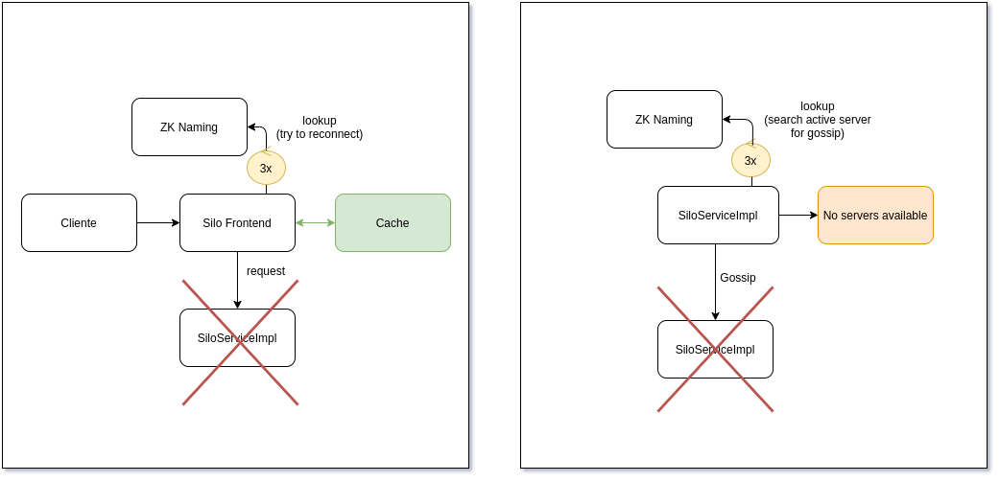

# Relatório do projeto Sauron

Sistemas Distribuídos 2019-2020, segundo semestre

## Autores

**Grupo A44**

| Número | Nome              | Utilizador                           | Correio eletrónico                                  |
| -------|-------------------|--------------------------------------| ----------------------------------------------------|
| 89421  | Bruno Meira       | <https://github.com/QuickSoOrt>      | <bruno.rafael.faria.meira@tecnico.ulisboa.pt>       |
| 89530  | Rafael Henriques  | <https://github.com/RafaelNHenriques>| <rafael.henriques@tecnico.ulisboa.pt>               |
| 89559  | Vasco Faria       | <https://github.com/vascofaria>      | <vasco.faria@tecnico.ulisboa.pt>                    |

  

## Melhorias da primeira parte

- [Mudamos o spotter para mostrar os resultados do TrackMatch organizados por id](https://github.com/tecnico-distsys/A44-Sauron/commit/b3e1788b9da3430bed82edaa3a0df8c196fdda41)

- [Aumentamos os testes no report, TrackMatch, Track e Trace](https://github.com/tecnico-distsys/A44-Sauron/commit/b3e1788b9da3430bed82edaa3a0df8c196fdda41)

- [Implementamos a sincronização correta de variáveis partilhadas](https://github.com/tecnico-distsys/A44-Sauron/commit/9c36c2a457fcc54d7433d6e9346362733adb5a94)

- [Melhorámos os comentários](https://github.com/tecnico-distsys/A44-Sauron/commit/36a25bd916bd6192b95fd077f1b7adf394f5478f)

## Modelo de faltas

Uma vez que estamos a utilizar uma variante do algoritmo gossip architeture com coêrencia fraca, temos de ter como foco a Avaiability e o Partition.
De forma a mantermos a Avaiability não podemos tolerar faltas de comunicação, no entanto como estamos a usar a ferramenta gRPC que usa HTTP 2.0 e que pode multiplexar varios RPCs na mesma conexão TCP permitindo que o gRPC tome decisoes de conexão sem que o aplicativo precise de estar ciente, não nos temos de preocupar diretamente em como previnir estas faltas uma vez que o gRPC já faz isso por nós. O mesmo acontece com o Zookeeper.
De forma a lidarmos com faltas de nós, toleramos a falha de uma réplica de um servidor desde que esta não seja a única.

## Solução

Figura 1, Figura 2

Na primeira figura estamos no caso em que um cliente perde conexão à réplica ou acaba de ser ligado e tenta se reconectar a outra réplica. O cliente irá buscar a lista de réplicas ao zk naming e escolhe de forma aleatória uma réplica tentando conectar-se a esta. Se não conseguir ele irá tentar outra vez aleatoriamente até repetir isto 3 vezes. Se depois de 3 tentativas o cliente não ligar a nenhuma réplica, ele irá tentar ver se tem a resposta em cache.

Na segunda vez estamos no caso em que uma réplica tenta mandar uma mensagem gossip a outra. Ele vai buscar a lista de réplicas ao zk naming e tenta ligar-se no máximo 3 vezes a uma das outras réplicas, se não conseguir assume que não há réplicas ativas e tentará novamente só no gossip seguinte.

## Protocolo de replicação

Uma vez que vamos utilizar uma variante do protocolo gossip architecture com coerência fraca, temos de ter como foco Availability e Partition tolerance, mas para tentar fornecer uma boa coerência na mesma recorremos ao uso de uma cache no lado do cliente. O nosso protocolo está dividido em duas partes:

- A comunicação cliente - réplica:

Para ocorrer esta comunicação o cliente começa por escolher uma réplica fixa com que  pretende comunicar ou não indicar nenhuma e assim é escolhida uma réplica aleatoriamente das que são obtidas pelo lookup no zk naming.

De seguida, ao chamar um dos web services, se a réplica ainda estiver disponível prossegue com o pedido normalmente enviando o seu timestamp (um vetor de inteiros em que cada um representa o número de updates da réplica n+1), se o timestamp for menor quer dizer que o cliente já fez querys em servidores mais avançados.

Em querys para não haver casos em que o cliente ‘perde’ informação ao mudar de servidor, o cliente tenta ligar-se a outra réplica que esteja mais avançado que ele, se depois de três tentativas o cliente não encontrar uma réplica ativa que esteja num estado igual ou superior a ele, ele tenta usar a sua cache para responder ao query.

No caso em que o cliente escolhe explicitamente que réplica usar e esta eventualmente falhar o cliente tenta fazer o pedido 3 vezes mas sempre na mesma réplica, ao fim do terceiro pedido sem sucesso recorre também ao uso da sua cache.

Esta cache é atualizada sempre que o cliente faz um query com sucesso.

No caso dos updates o cliente manda um timestamp e se tiver sucesso a réplica avança um número da timestamp no inteiro que lhe representa, e o cliente recebe o seu timestamp antigo com o mesmo incremento no inteiro que representa a réplica que recebeu o update.

- A comunicação réplica - réplica: 

Para fazer os updates (gossips) periódicamente cada réplica contacta com outra réplica aleatoriamente.

Por exemplo, uma réplica A vai contactar com uma réplica B e enviar  as  modificações do log de A (uma lista dos updates que recebeu) que estima B não ter.

Estas modificações são estimadas através dos timestamps que se encontram na timestamp_table (uma tabela que tem os timestamps estimados pela réplica de todas as réplicas), por exemplo se o ts de A for <1,2> e o de B for <1,1> então A vai enviar tudo o que seja acima de <1,1>. Para cada modificação que B recebe, se esta não for duplicada, acrescenta-a ao seu log e atualiza o timestamp.

A timestamp _table é atualizada sempre que uma réplica manda com sucesso um gossip a outra réplica ou quando recebe um gossip de outra réplica.
Apesar de a réplica que manda o gossip tentar estimar os updates necessários, a réplica que recebe o gossip verifica à mesma se necessita de todos os updates para não haver duplicações.

Se a réplica tentar fazer gossip a um servidor que esteja em baixo, ela tenta ligar se a outro aleatoriamente. Passado 3 tentativas ela desiste e tenta só no próximo gossip. Este gossip é feito de 30 em 30 segundos se não for especificado nenhum intervalo de tempo específico.

## Opções de implementação

Nós pusemos um número máximo de servidores de 9.Do port 8081 ao 8089 principalmente para simplificação da implementação.

Nós em tentativas de ligação a um servidor (seja para gossip ou para um cliente se ligar a um servidor) decidimos que serão feitas três tentativas de ligação aleatórias antes de o cliente/servidor desistir de tentar ligar.

 No caso de um cliente ligar a um servidor se ele não se conseguir ligar ou se o servidor estiver desatualizado o cliente vai à cache se for um spotter ou desiste da operação se for um eye.

 No caso do servidor se ele não se conseguir ligar a um servidor, ele desiste de mandar esse gossip.

O nosso update log não é apagado mas um servidor tenta sempre mandar só o que acha que é preciso na mensagem gossip.O update log não é apagado para poder atualizar um servidor que for ligado quando todos os outros já estão atualizados.

## Notas finais
Devido ao cliente escolher a réplica aleatoriamente, se houver uma réplica que esteja em baixo pode aconetecer o eye não se conseguir ligar a uma réplica devido a tentar três vezes em réplicas em baixo e depois desistir.
